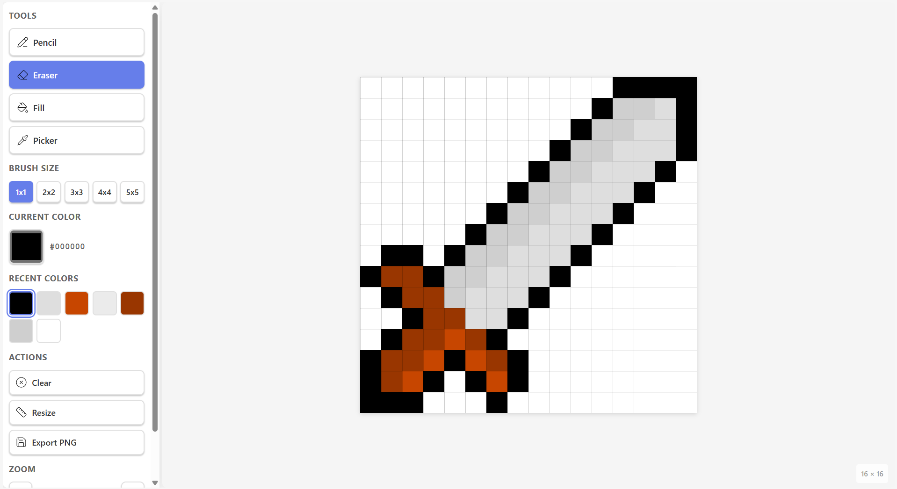

# 🎨 Pixlet

A modern, lightweight pixel art editor built with Vue 3, TypeScript, and Tauri. Create pixel art with an intuitive interface, powerful drawing tools, and seamless performance.

## ✨ Features

### 🖌️ Drawing Tools
- **Pencil** - Draw with customizable brush sizes (1x1 to 5x5 pixels)
- **Eraser** - Remove pixels with brush size support
- **Fill Bucket** - Flood fill areas with a single click
- **Eyedropper** - Pick colors directly from the canvas

### 🎯 Canvas Features
- **Fixed Canvas Size** - Professional 640x640px viewport with variable cell sizes
- **Grid System** - Adjustable grid from 8x8 to 64x64 pixels
- **Zoom Controls** - Zoom from 25% to 400% with mouse wheel support
- **Hover Preview** - See exactly where you'll draw before clicking
- **Smooth Drawing** - Bresenham's line algorithm prevents pixel skipping

### 🎨 Color Management
- **Color Picker** - Full spectrum color selection
- **Color History** - Automatically tracks your last 20 used colors
- **Quick Selection** - Click any recent color to reuse it instantly

### ⚡ Performance
- **Canvas Rendering** - HTML5 Canvas API for blazing-fast performance
- **Optimized Grid** - Handles 64x64 grids smoothly (4096+ pixels)
- **Crisp Display** - Pixel-perfect rendering at all zoom levels

### 💾 File Operations
- **Export PNG** - Save your pixel art as 1:1 scale PNG files
- **Undo/Redo** - Full history support (up to 50 states)
- **Clear Canvas** - Start fresh with confirmation dialog

### ⌨️ Keyboard Shortcuts
- `Ctrl+Z` / `Cmd+Z` - Undo
- `Ctrl+Y` / `Cmd+Y` - Redo
- `Ctrl+Shift+Z` / `Cmd+Shift+Z` - Alternative redo
- Mouse wheel - Zoom in/out

